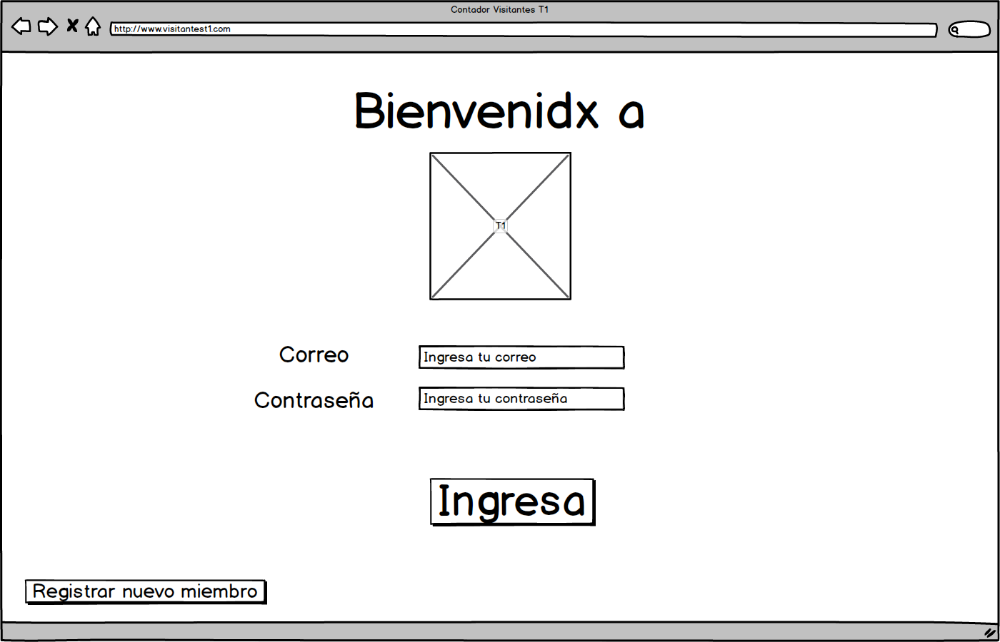
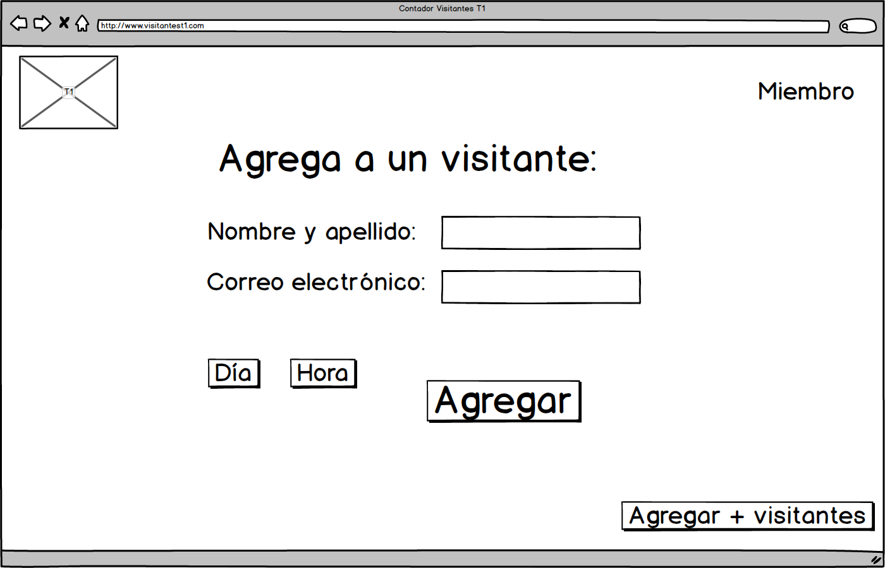
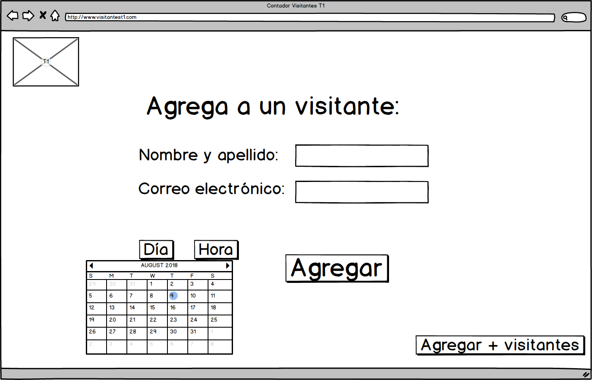
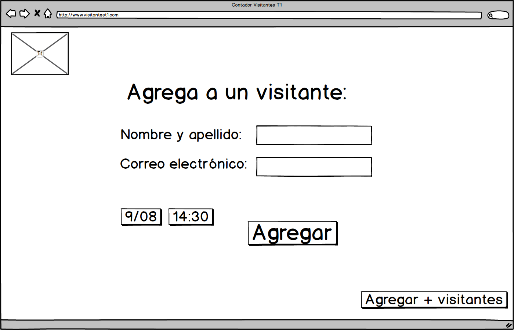
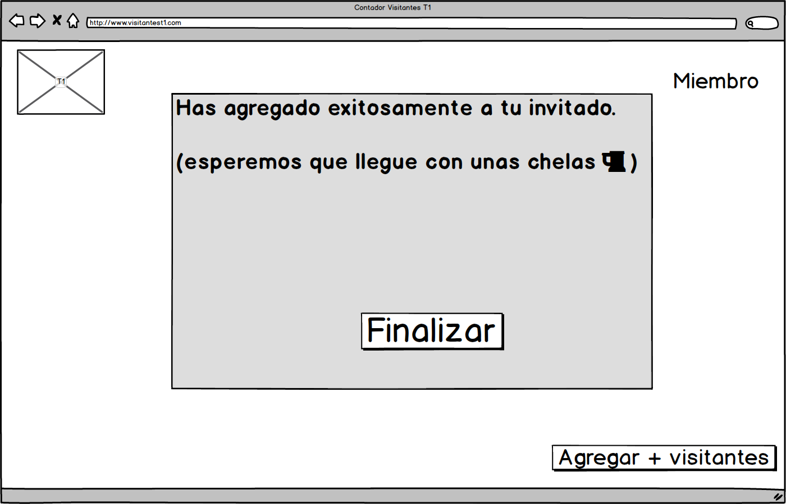
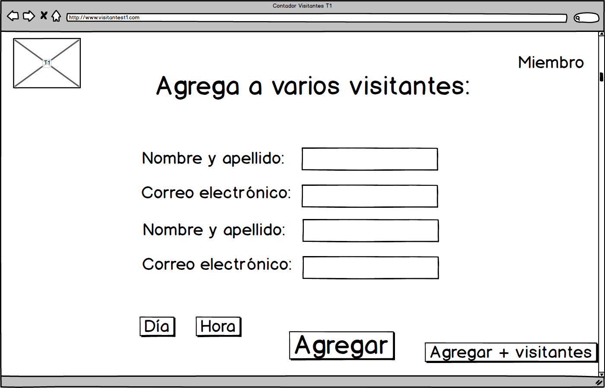
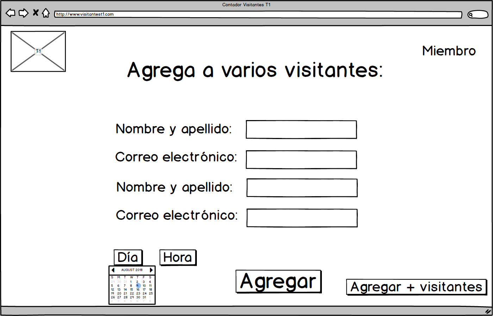
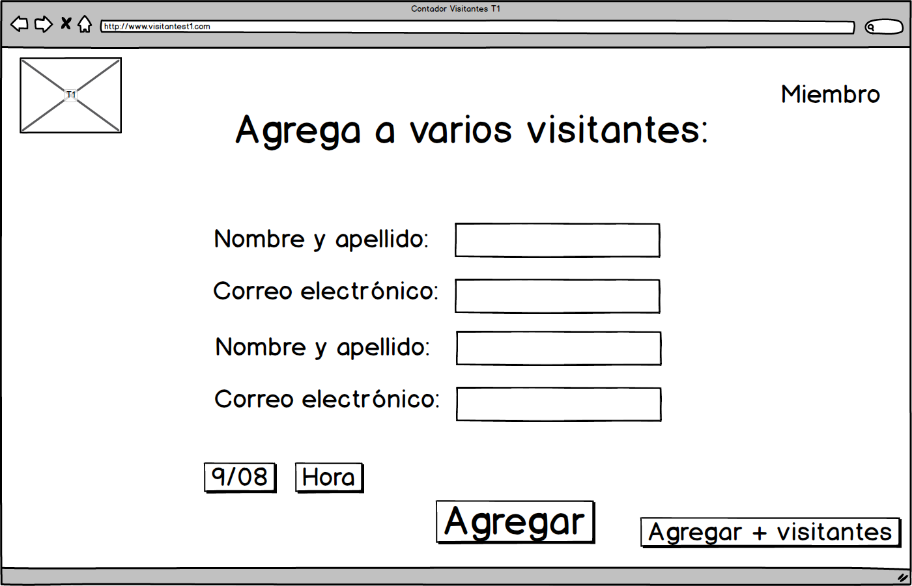
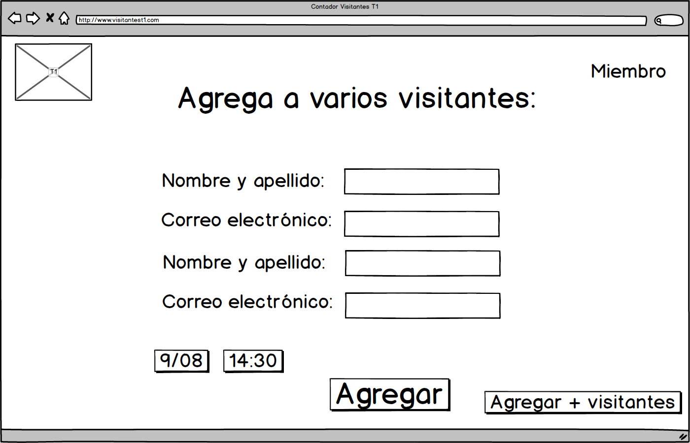
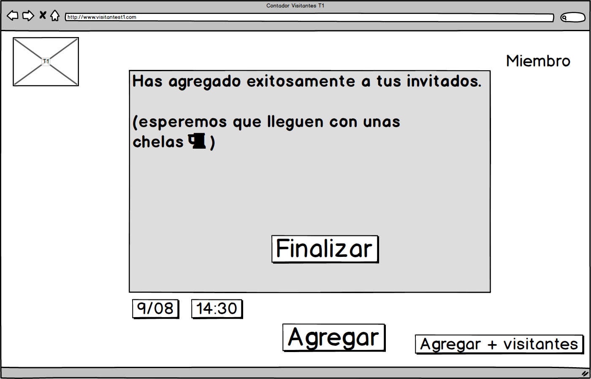

## Contador de visitantes de Terminal 1 :office:

  
Terminal 1 es una franquicia de coworking. Como parte de la modernización de sus instalaciones han decidido implementar una serie de cambios. Uno de ellos es incorporar una interfaz para el registro de persona externas al coworking.

## Motivaciones    :stars:

Este contador está pensado principalmente para que exista un control interno por parte de Terminal 1 y controlar de una manera más eficiente a las personas que entran al espacio.

La necesidad de hacer este contador reside en primer lugar: el aumento de los robos a negocios y casa habitación en la Ciudad de México ha aumentado drásticamente en los últimos años. Según el Secretariado Ejecutivo del Sistema Nacional de Seguridad Pública (SESNSP) la incidencia delictiva se incrementó un 11.4% en la Ciudad de México, siendo la delegación Cuauhtémoc, delegación donde se encuentran los dos edificios administrados por Terminal 1, una en las que más se notó un incremento en la actividad delictiva.

Como consecuencia a estos hechos se decidió implementar este control de acceso para que la gente que renta un lugar en este coworking (miembro) se sienta protegido y respaldado por la administración de Terminal.  
  
  
## Features   :rocket:

  
Por el momento se realizaron 3 entrevistas. La primera fue a Indira Gutiérrez, colaboradora de la startup EasyBroker, cuyas oficinas se encuentran en A255, coworking ubicado en la calle de Ámsterdam, número 255, colonia Condesa, delegación Cuauhtémoc; la segunda fue a Fabiola Pineda, administradora de A255; la tercera fue hecha a Batú Oliva, guardia de seguridad de We Work Insurgentes, con dirección en Insurgentes Sur, número 601, colonia Nápoles. (tanto las transcripciones de las entrevistas como los audios de estas se encuentran en el apartado de “Anexos”). Y además se hizo una visita encubierta a We Work Insurgentes, poniendo de pretexto el asistir a un taller en dichas instalaciones.

Con estas tres entrevistas y la visita encubierta dimos con varios puntos importantes para empezar a diseñar nuestro sitio y así diseñar pensando en nuestros principales usuarios.

El primer punto: Las personas que visitan dichos espacios no están en contacto con la plataforma. Solo los administradores o guardias de seguridad pudieron verificar la información administrada previamente en su plataforma. Al preguntarles si les gustaría que los visitantes fueran los que interactuaran con la interfaz, contestaron negativamente pues ellos prefieren tener el control de los accesos ya que esto les da certidumbre de quién entra.

En Segundo lugar, detectamos un importante pain point con la miembro del coworking: que si tenían un evento tenían que registrar a cada invitado uno por uno. Por lo que decidimos atacar este problema al poner en nuestra plataforma que el miembro pueda ingresar a más de una persona a la vez, ahorrándole mucho tiempo.

  
  
## Historia de Usuarixs   :family:

| Historia de Usuarix  Nr.1|

|---|

| Fecha:  08/08/2018|

| Nombre de la Usuaria:  Diana Sánchez |

| Edad: 28 años |

| Título28 años |

| Voy a una entrevista de trabajo a una empresa cuyas oficinas están en un coworking. Gracias al tráfico voy con el tiempo justo para la entrevista. Temo que al llegar al coworking tenga que perder mucho tiempo en registrarme. Me gustaría que el registro fuera más rápido y ágil para no llegar tarde a mi entrevista.|

|Historia de Usuarix Nr.2|

|---|

|Fecha: 08/08/2018|

|Nombre de la Usuaria: Jorge Bolaño|

|Edad: 40 años|

|Título: Administración|

|Como gerente del edificio necesito de una plataforma en la que pueda ver la gente que entra a mi edificio. Su nombre, hora de entrada y su foto por si algún inconveniente surge. |

---------

|Historia de Usuarix Nr.3|

|---|

|Fecha: 08/08/2018|

|Nombre de la Usuaria: Adriana Sivan|

|Edad: 35 años|

|Título: Dar de alta|

|Soy la CEO de una Startup. En la actualidad estoy en busca de nuevos colaboradores. Como soy una persona muy ocupada no puedo perder mucho tiempo en registrar a la gente que venga a las entrevistas (hablar con recepción, informar quién viene y a qué hora y demás) Requiero de una plataforma en la que en los menos clics posibles pueda ingresar al sistema la persona que entrará.|

## Mockups   :incoming_envelope:

## Prototipo con flujo  :envelope:

El prototipo con flujo se encuentra alojado en la página web de Marvel App:

https://marvelapp.com/39didi4

## Anexos   :page_facing_up:

#### Transcripción de entrevistas

**Entrevista realizada a Fabiola Pineda, administradora de A255, edificio de coworking, ubicado en Ámsterdam 255, col. Condesa.**

**Sandra Salinas, Entrevistadora**: Te vamos a platicar un poquito lo que estamos haciendo: Vamos a desarrollar una aplicación sobre registros para que sea más fácil poder llevar el registro de los visitantes. Entonces lo que nosotras queremos es que tu ahorita nos platiques un poquito la experiencia de la plataforma que utilizas para registrar, entonces te vamos a hacer un par de preguntas, pero primero quiero que me cuentes… si me puedes contar cómo es el proceso del registro de los visitantes desde tu punto de vista.

**Fabiola Pineda, Administradora de A255**: Pues ahorita tenemos poco menos de un mes que tenemos el biométrico y es por medio de la huella digital. Se les asigna numero y ya nosotros desde aquí lo coordinamos con el biométrico para que ya aparezca su nombre personalizado, para que ingresen…

**EN**: ¿Es la huella de quienes trabajan…

**FF**: Los miembros. Los que tienen oficinas o espacio de coworking.

**EN**: Y, por ejemplo, en el escenario que hoy esta Indira nos registró a Andrea y a mi ¿cómo es que te llega la información de que dos personas fueron registradas?

**FF**: Por que ella desde la plataforma de la pagina de internet tienen que meter a sus visitantes con el nombre completo y con el correo electrónico y eso nos llega a nosotros directo, entonces tenemos un apartado que es de visitantes en donde y ahí nos aparecen todos los miembros y los visitantes que registran.

**EN**: Al momento de hacerse el registro se actualiza automáticamente o ¿cómo es el proceso?

**FF**: Si, se va actualizando y ya nada más cuando llegan el vigilante manda una alerta al correo electrónico de la persona que ya ha llegado su visita para que puedan pasar.

**EN**: Tú tienes… hay un momento en el que tú le tengas que avisar a la persona que registró que ya está la gente dentro…

**FF**: De hecho, aquí manda la alerta y les llega el correo a ellas y también les llaman por cualquier cosa.

**EN**: ¿Y a ti te llega una alerta por correo electrónico?

**FF**: En cuanto, ya sea el vigilante o yo, le damos que ya ha llego la persona, me llega a mi correo electrónico y le debe de llegar a la persona.

**EN**: ¿Podría ver muy por encima cómo están…cómo funciona tu plataforma, ¿cómo están distribuidos nada más los espacios? Sin necesidad de ver información que no…

**FF**: Te va a aparecer toda la información de todos los socios, de todos los miembros conforme los van registrando.

**EN**: Y, por ejemplo, en el escenario donde llega una persona sin avisar, alguna visita…

**FF**: Lo registramos.

**EN**: Ustedes los registran ahí… ¿cuál es el proceso para registrarlo?

**FF**: Le pedimos el nombre completo y el correo electrónico.

**EN**: ¿Y dónde pones ese correo?

**FF**: En el apartado de visitas. Y ya pongo el miembro que vienen a visitar y nosotros ya tenemos en la plataforma toda la información de los miembros junto con su correo para que les pueda llegar la información.

**EN**: ¿Lo tienes de manera desplegable la información de los miembros?

**FF**: Eso está en un sistema que tenemos nosotros es privado.

**EN**: Y la manera en que se les avisa ¿cómo es?

**FF**: Por medio de correo electrónico.

**EN**: Es la misma dinámica de cuando alguien ya tiene previa cita a alguien que llega de manera aleatoria, ok. Y si tú, por ejemplo, pudieras mejorar algo de la plataforma, algo que te gustaría que tuviera como para que tus tiempos fueran, a lo mejor, un poquitos más rápidos o más amigables ¿Qué le mejorarías o qué le cambiarías?

**FF**: Pues siento que ahorita es muy rápido, el sistema es rápido porque te lo lanza todo por correo electrónico, entonces es rapidísimo porque nada más le apretamos que ha llegado y automáticamente le llega a la persona el correo a la persona.

**EN**: Ok, tú no has tenido algún problema, no hay nada que le gustaría cambiarle, mejorar.

**FF**: Pues no, porque más bien es de los miembros. Si ellos hacen sus registros de visitas no hay ningún problema. Si no lo hacen es un poco más tardado porque yo le tengo que registrar la información a las personas.

**EN**: ¿Y a la persona que llega se le da algún tipo de gafete o credencial?

**FF**: Se le da un gafete que tu los identificas como visita, no como miembro.

**EN**: y te gustaría, que a lo mejor, el proceso fuera… que tú no tuvieras que registrarlo sino que la misma persona que llega se registrara de manera digital, que ellos mismos registraran sus datos o es prácticamente igual.

**FF**: Yo siento que es prácticamente igual, porque es lo mismo que yo hago, pedirles información que nada más son el nombre completo y el correo. No necesitamos más información de la persona para poder avisarle al miembro que ya está aquí, por eso se me hace amigable porque siento que en otras empresas tienen que dar más datos, a que empresa vienen y aquí no, aquí si ya está registrado automáticamente nos aparece la información necesaria y le llega el correo a la persona a la que viene a visitar.

**EN**: ¿En caso de que falle el registro con internet… ha habido momentos en los que falle el internet y como… sí si ¿cómo es que lo han solucionado?

**FF**: Sí si también en vigilancia tienen una bitácora y toman la misma información y ya después lo pasamos al sistema, pero no ha habido mayor problema.

**EN**: Te gustaría que al momento de tener a un visitante poder tomarle una foto como tener esa parte más segura del registro, para saber quien está entrando al edificio.

**FF**: Pues de que me gustaría si, pero la verdad es que no lo veo muy rentable porque si para las huellas muchos pusieron peros porque es algo como personal, esa información, entonces para el registro de huellas fue difícil; para poner fotos no siento que sea rentable. Sería más molesto.

**EN**: Yo me imagino que iría en contra de la filosofía del coworking ¿no?

**FF**: Si porque en si el tomado de huellas es para distinguir a los miembros de las visitas. Si tu eres miembro tienes que poner tu huella y nadie más puede entrar por la misma seguridad que tiene…

**EN**: Y te iba a preguntar también, para entrar al registro, para tu poder registrar a alguien tienes que iniciar sesión o cualquier persona puede acceder a…

**FF**: No, cuando ya eres miembro de aquí, de A255, se les da una cuenta y una contraseña, se les manda correo y solo así pueden ingresar a un sistema y hacer uso de todas las instalaciones.

**EN**: Pero tú que eres la que lleva el control de las que va recibiendo todas las que van entrando y todo eso, tu tienes que iniciar sesión,  poner algún correo y contraseña o.,.

**FF**: Si, para entrar a nuestra pagina

**EN**: ¿Y ese correo o contraseña, la contraseña tú la personalizaste o ya se te dio?

**FF**: No, yo la personalicé.

**EN**: Entonces, del perfil que tu tienes al perfil que tiene esta Indie es diferente, dime que es lo que…la diferencia.

**FF**: Que yo soy la administradora de la aplicación directamente.

**EN**: Tú le puedes cambiar cosas.

**FF**: Exactamente. Nosotros como administrador, como miembros directamente de A255 podemos hacer modificaciones del sistema.

**EN**: Me imagino que tu puedes quitar a miembros que ya no están…

**FF**: Exactamente. Activar, desactivarlos.

**EN**: Hoy es miércoles, mañana obviamente es jueves. ¿La información del miércoles se junta con la información del jueves o se guarda en algún lugar?

**FF**: No se junta, va como por día, y dependiendo. mañana me va a mostrar los que van a venir mañana y tenemos registros anteriores y visitantes antiguos que aparecen.

**EN**: Y por ejemplo, si tú quieres consultar los de el lunes como haces esa consulta.

**FF**: (ininteligible)

**EN**: Pero cuales son los pasos que tú tienes que dar a esa…

**FF**: Nada más poner visitantes antiguos…

**EN**: ¿Es a través de tal cual una frase que dice y que te despliega?

**FF**: Todos los visitantes. Me pone dentro de 21 días, hace dos horas, hace un día, hace dos horas.

**EN**: Y te los muestra.

**FF**: Puedo buscar tanto por el nombre del visitante como por el nombre de la persona que viene, yo por ejemplo, Indira las registró a ustedes, yo puedo poner las visitantes que registró Indira, me van a salir todas las visitantes que ha tenido ella, todos

**EN**: Pero si puede escoger en específico el viernes tal, te aparece un calendario o como es la manera en que…

**FF**: Me aparece el mes y me aparecen los días y ya le doy clic y me aparece.

**EN**: ¿Cómo un calendario normal?

**FF**: Si.

**EN**: ¿Nada más me podrías dar tu nombre completo y tu cargo aquí?

**FF**: Soy administradora de A255 y mi nombre es Fabiola Pineda.

##### Audios, videos y fotos se encuentran en la siguiente url

[Anexos]( https://drive.google.com/open?id=1V2HJcdHESgIFzPzamvhatZU348ZF5hUm)
